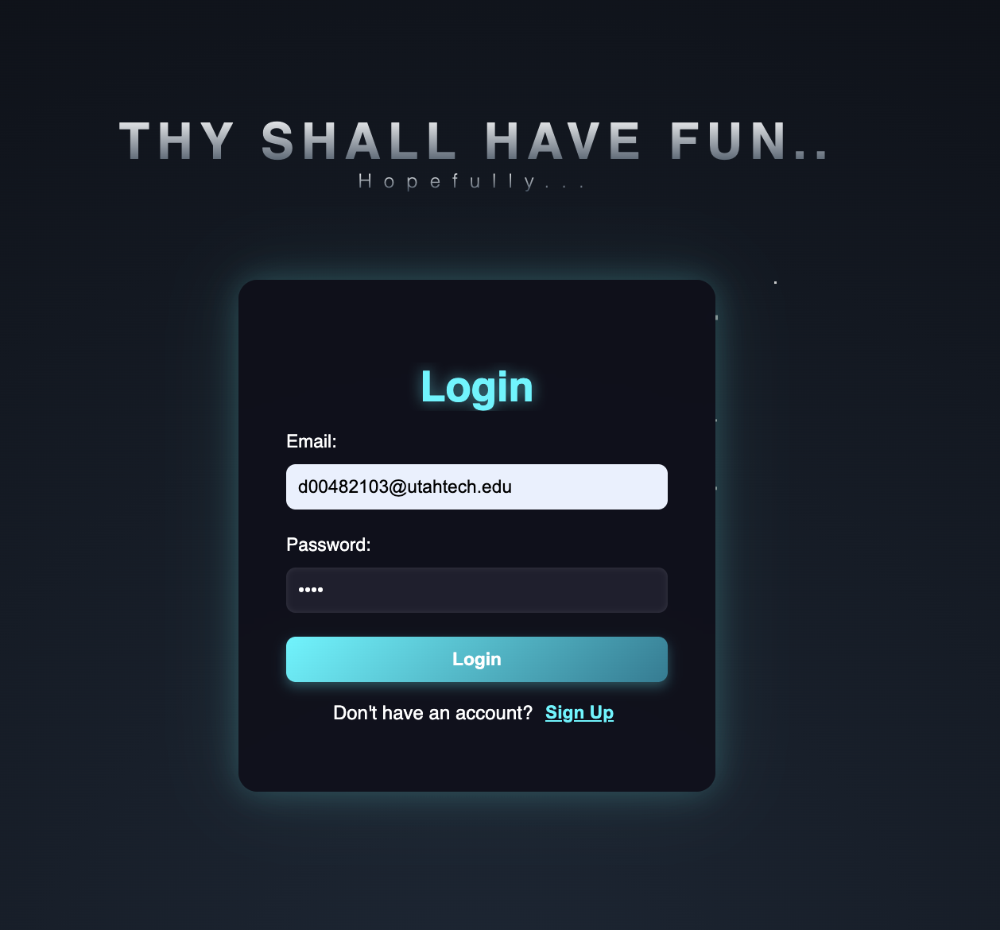
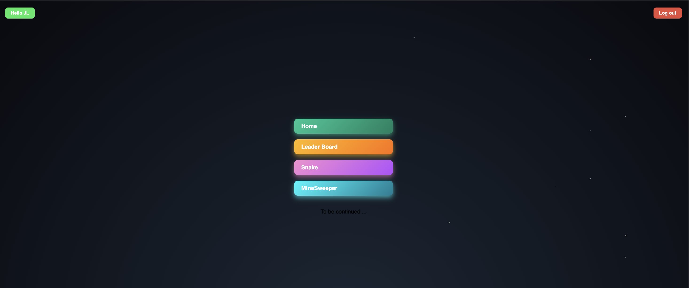
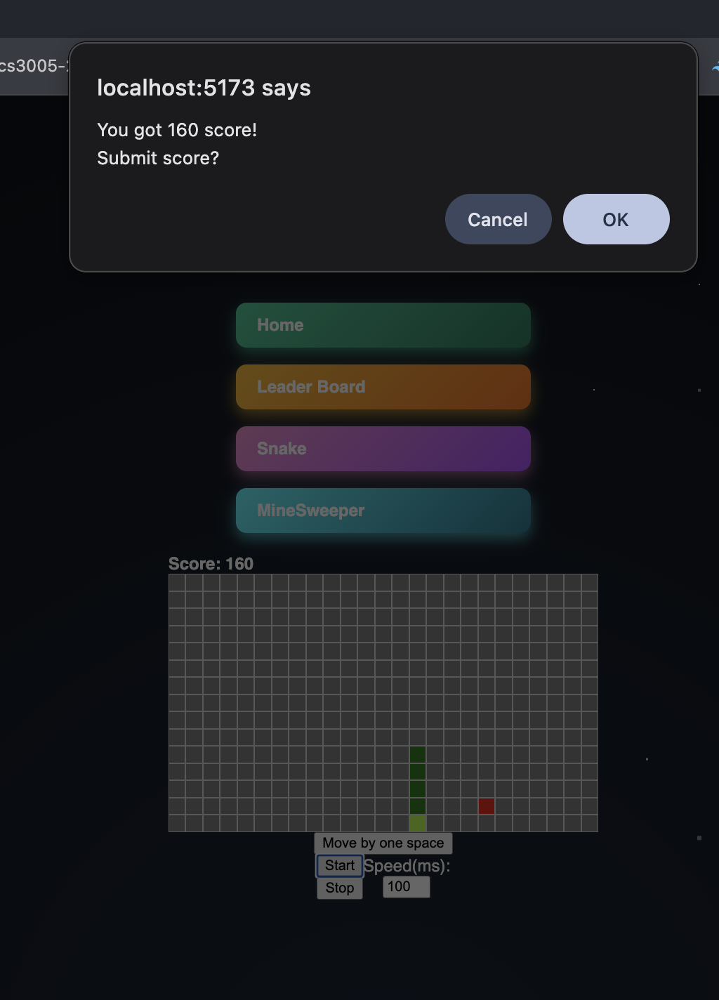
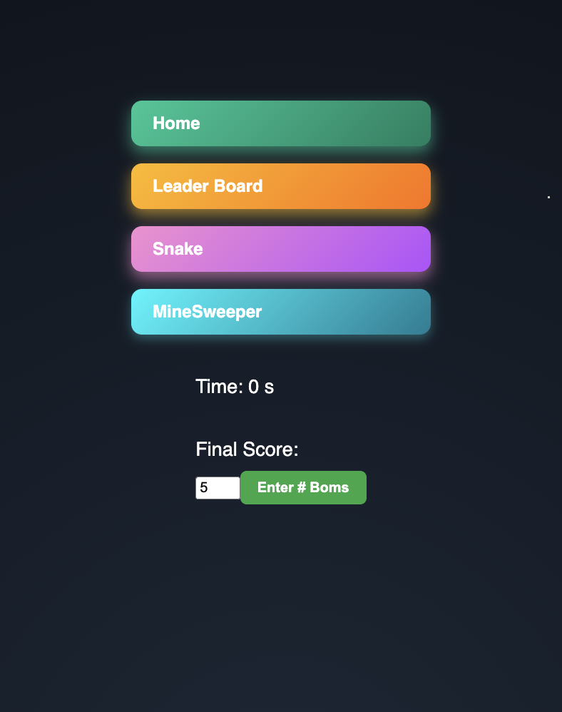
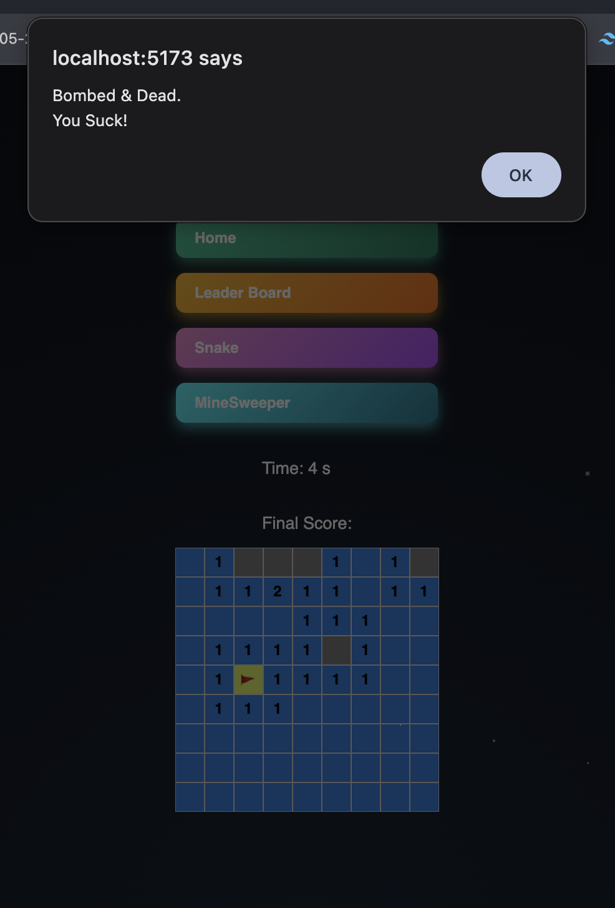
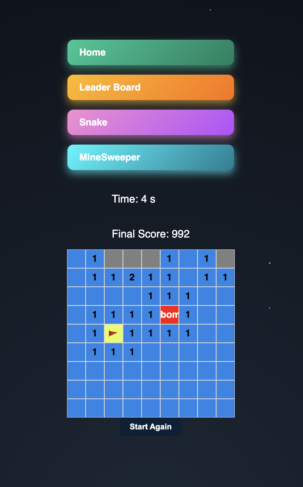
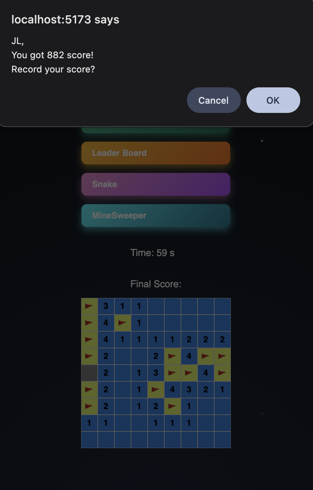
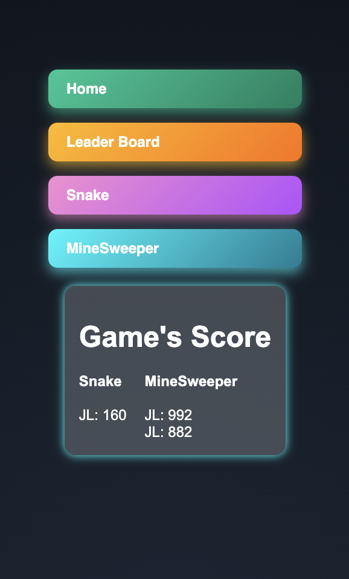

# 🕹️ Arcade Platform

A full-stack web arcade featuring classic games like **Minesweeper** and **Snake**, complete with a persistent global leaderboard and user authentication.

### 📸 Project Preview




<details>
  <summary><b>View More Gameplay Screenshots</b></summary>
  
  **Snake**
  
  
  **Minesweeper**
  
  
  
  
  
  
  **Leaderboard**
  
</details>

---

## 🚀 Features

- **User Accounts:** Secure signup and login using Bcrypt encryption.
- **Global Leaderboard:** Compete for high scores stored in MongoDB.
- **Classic Games:** Fully playable Snake and Minesweeper built with Vue.js.
- **Responsive Design:** Playable on various screen sizes.

## 🛠️ Tech Stack

- **Frontend:** Vue.js + Vite
- **Backend:** Node.js + Express
- **Database:** MongoDB Atlas
- **Authentication:** JWT / Express-Session & Bcrypt

---

## 📦 Getting Started

### Prerequisites

- **Node.js** (v18 or higher recommended)
- A **MongoDB Atlas** account and cluster.

### 1. Backend Setup

Navigate to the backend directory:

```bash
cd backend
```
